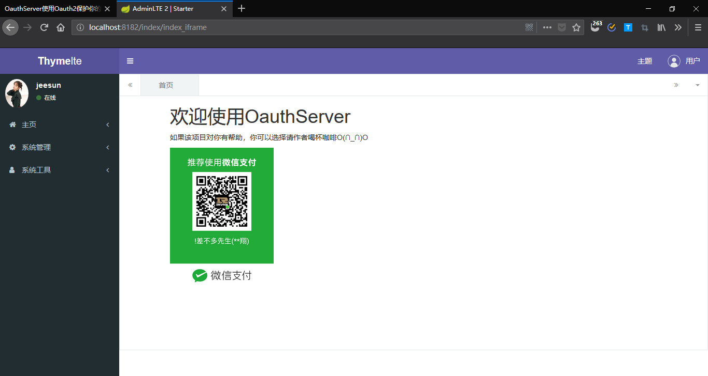

# oauthserver
## 简介
oauthserver是一个基于Spring Boot Oauth2的完整的独立的Oauth2 Server微服务。仅仅需要创建相关数据表，修改数据库的连接信息，你就可以得到一个Oauth2 Server微服务。  
为了开发方便，项目拆分成两个模块，api和web。api运行在8181端口，web运行在8182端口。api模块是提供api服务的，主要是oauth token、支付等接口；web是管理端。

支持的关系型数据库：
- MySQL

## 功能概览
### api
1. Oauth token服务；
2. 微信、支付宝支付；
3. 七牛云存储；
3. 代码生成器。
### web
1. 主页
   1. 了解OauthServer
   2. 新闻管理
   3. 订单管理
2. 系统管理
   1. 定时任务
   2. 菜单管理
   3. 用户管理
   4. 权限管理
   5. 数据字典
3. 系统工具
   1. 代码生成
   2. swagger
   3. druid
   4. 日志管理
## 更新日志
### 1.3.0
1. 项目拆分成两个模块，api和web；api运行在8181端口，web运行在8182端口。
2. 代码生成器[http://localhost:8181/tables?easyui-list](http://localhost:8181/tables?easyui-list)和[http://localhost:8182/tables?easyui-list](http://localhost:8182/tables?easyui-list)
3. 大量更新；

**更多历史更新日志查看[CHANGE_LOG.md](tutorial/CHANGE_LOG.md)**

## 使用流程
### 1. 安装jar
有部分自建jar在中央仓库是没有的，需要使用`mvn install`安装到本地。执行“需要安装的jars”文件夹下的`install.bat`安装。
### 2. 建表
- MySQL  
请执行`数据初始化脚本.sql`，完成数据表的创建和测试数据的导入。
### 3. 修改数据库连接信息
- MySQL  
连接信息在`application-mysql.yml`里。修改完数据库连接信息后，还需要设置`application.yml`的`spring.profiles.active=mysql`。  
### 4. 运行
现在，一切已准备就绪。运行项目，当程序成功启动时，即表明你已配置成功。

## api测试
[oauth接口调用示例](tutorial/api.md)

## 管理端页面
测试账号：手机号18800000000，密码1234567890c
### 管理端页面样式1
访问地址：[http://localhost:8182/index/index_v1](http://localhost:8182/index/index_v1)

### 管理端页面样式2
访问地址：[http://localhost:8182/index/index_iframe](http://localhost:8182/index/index_iframe)
