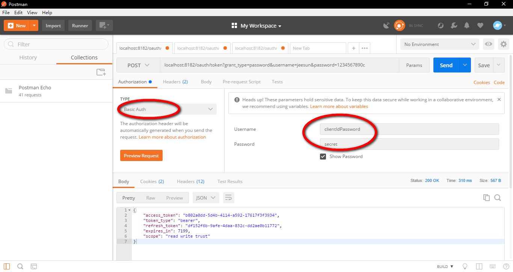

<p align="center">
<a href="http://www.oracle.com/technetwork/java/javase/overview/index.html"></a>
<a href="https://www.jetbrains.com/idea/"></a>
<a href="http://projects.spring.io/spring-boot/"></a>


</p>

# oauthserver
## 简介
oauthserver是一个基于Spring Boot Oauth2的完整的独立的Oauth2 Server微服务。仅仅需要创建相关数据表，修改数据库的连接信息，你就可以得到一个Oauth2 Server微服务。

Oauth2 Client通常是要被保护的资源，例如app接口。配套的Oauth2 Client示例可以在这里找到[https://github.com/jeesun/qbankserver](https://github.com/jeesun/qbankserver)。

支持的关系型数据库：
- PostgreSQL
- MySQL

已实现的功能：
1. 集成Spring Boot Oauth2，实现Oauth服务；
2. token保存到关系型数据库；
3. 获取token时，username允许传用户名、手机号或者邮箱；
4. token获取支持密码模式和授权码模式；
5. 日志记录保存到文件，并按日归档；
6. 数据库连接信息加密；
7. 集成Druid数据库连接池；
8. 自定义Oauth2Exception异常返回的json信息。


请下载与Spring Boot对应版本的oauthserver：
<table border="0">
  <tr>
    <th>Spring Boot version</th>
    <th>oauthserver version</th>
  </tr>
  <tr>
    <td>1.x.x</td>
    <td>1.x.x</td>
  </tr>
  <tr>
    <td>2.x.x</td>
    <td>2.x.x</td>
   </tr> 
</table>

## 升级指南
oauthserver从v1.2.0以前版本（不包括v1.2.0）升级到v2.x，或者是使用v2.x版本，需要修改数据表oauth_client_details的clicent_secret列的值，从明文secret改为经过Scrypt加密的字符串$2a$11$uBcjOC6qWFpxkQJtPyMhPOweH.8gP3Ig1mt27mGDpBncR7gErOuF6。

## 更新日志
### v1.2.0(2018-07-25)[下载](https://codeload.github.com/jeesun/oauthserver/zip/v1.2.0)
- 集成Mybatis，以及Mybatis三大插件：通用Mapper，Mybatis-Plus，PageHelper；
- 集成swagger2，并配置非全局、无需重复输入的header参数（token），访问[http://localhost:8182/swagger-ui.html](http://localhost:8182/swagger-ui.html)；
- authorities表使用user_id代替username字段；
- 集成Redis缓存；
- 自定义登录页面和授权页面，并修复授权码模式与密码模式共存问题；
- 更棒的接口示例HelloWorldController，强烈建议您阅读该Controller代码。

### v2.0.0.alpha(2018-07-16)[下载](https://codeload.github.com/jeesun/oauthserver/zip/v2.0.0.alpha)
- 升级Spring Boot版本从1.5.14.RELEASE到2.0.3.RELEASE。

### v1.1.1(2018-07-07)[下载](https://codeload.github.com/jeesun/oauthserver/zip/v1.1.1)
- 升级Spring Boot版本从1.5.13.RELEASE到1.5.14.RELEASE；
- 修复检查的access_token无法识别时，返回中文message。

### v1.1.0(2018-06-01)[下载](https://codeload.github.com/jeesun/oauthserver/zip/v1.1.0)
- 自定义Oauth2Exception异常返回的json信息。

### v1.0.3[下载](https://codeload.github.com/jeesun/oauthserver/zip/v1.0.3)
- bug修复。

### v1.0.1[下载](https://codeload.github.com/jeesun/oauthserver/zip/v1.0.1)
- 获取token时，username允许传用户名、手机号或者邮箱。  

### v1.0.0[下载](https://codeload.github.com/jeesun/oauthserver/zip/v1.0.0)
- 完成基础Oauth服务。

## 使用流程
### 1. 建表
- PostgreSQL
请执行`src/main/resources/schema-pg.sql`，完成数据表的创建和测试数据的导入。
- MySQL
请执行`src/main/resources/schema-mysql.sql`，完成数据表的创建和测试数据的导入。
### 2. 修改数据库连接信息
在application.yml中，配置着数据库的连接信息。其中，配置项username和password是要经过jasypt加密的，~~不能直接填明文~~，也可直接填明文。加密密钥由`jasypt.encryptor.password`配置。你需要使用test目录下的UtilTests工具得到加密字符串。
- PostgreSQL
```
# PostgreSQL连接信息
    driver-class-name: org.postgresql.Driver
    url: jdbc:postgresql://127.0.0.1:5432/thymelte?useUnicode=true&amp;characterEncoding=UTF-8
    username: ENC(hTpbG9fq+7P3SntmXuNtDxbtWDqRuPV+) #明文postgres
    password: ENC(abdq6LyOspryFQHCqzEMTxRozyJVjIA4) #明文19961120
```

- MySQL
```
# MySQL连接信息
    driver-class-name: com.mysql.jdbc.Driver
    url: jdbc:mysql://127.0.0.1:3306/thymelte?useUnicode=true&characterEncoding=utf-8&useSSL=false
    username: ENC(YiYjVwTulDGN//YaB3KbuA==) #明文root
    password: ENC(BZUIhx1tIC75T4JTYROwbsPIRuhrPQMx) #明文19941017
```
### 3. 运行
现在，一切已准备就绪。运行项目，当程序成功启动时，即表明你已配置成功。
### 4. 测试
在建表时，我已经向表添加了测试数据。以下请求参数的值，均是测试数据，在数据表中可以找得到。请根据需求到数据表中修改对应的值。    
在表`oauth_client_details`表中，已有一条测试数据。列`client_id`和`client_secret`的值，分别对应Basic Oauth的请求参数`username`和`password`的值。而列`access_token_validity`和列`refresh_token_validity`，分别代表access_token和refresh_token的有效期时间，以秒为单位。测试数据7200和5184000，分别代表2个小时和2个月（60天）。这是一个比较合理的有效期时间的设置，可以参考。

**token相关的接口，都需要进行Basic Oauth认证。**  
如下图所示：  

> 1、根据用户名和密码获取access_token
>> POST [http://localhost:8182/oauth/token?grant_type=password&username=jeesun&password=1234567890c](http://localhost:8182/oauth/token?grant_type=password&username=jeesun&password=1234567890c)

**成功示例**  
status=200，返回的json数据：
``` json
{
    "access_token": "ca582cd1-be6c-4a5a-82ec-10af7a8e06eb",
    "token_type": "bearer",
    "refresh_token": "c24a6143-97c8-4642-88b9-d5c5b902b487",
    "expires_in": 3824,
    "scope": "read write trust"
}
```
**失败示例**  
1. 用户名错误  
status=400，返回的json数据：
``` json
{
    "code": 400,
    "message": "用户名不存在",
    "data": null
}
```
2. 密码错误  
status=400，返回的json数据：
``` json
{
    "code": 400,
    "message": "密码错误",
    "data": null
}
```
3. 账号被封enabled=false  
status=400，返回的json数据：
``` json
{
    "code": 400,
    "message": "您已被封号",
    "data": null
}
```

> 2、检查access_token
>> GET [http://localhost:8182/oauth/check_token?token=ca582cd1-be6c-4a5a-82ec-10af7a8e06eb](http://localhost:8182/oauth/check_token?token=ca582cd1-be6c-4a5a-82ec-10af7a8e06eb)

**成功示例**  
即使用户被封enabled=false，access_token未过期仍然可用。  
status=200，返回的json数据：
``` json
{
    "aud": [
        "oauth2-resource"
    ],
    "exp": 1524507296,
    "user_name": "jeesun",
    "authorities": [
        "ROLE_ADMIN",
        "ROLE_USER"
    ],
    "client_id": "clientIdPassword",
    "scope": [
        "read",
        "write",
        "trust"
    ]
}
```
**失败示例**  
access_token已过期  
status=400，返回的json数据：
``` json
{
    "code": 400,
    "message": "Token无法识别",
    "data": null
}
```

> 3、根据refresh_token获取新的access_token
>> POST [http://localhost:8182/oauth/token?grant_type=refresh_token&refresh_token=c24a6143-97c8-4642-88b9-d5c5b902b487](http://localhost:8182/oauth/token?grant_type=refresh_token&refresh_token=c24a6143-97c8-4642-88b9-d5c5b902b487)

**成功示例**  
status=200，返回的json数据：
``` json
{
    "access_token": "690ecd7d-f2b7-4faa-ac45-5b7a319478e8",
    "token_type": "bearer",
    "refresh_token": "c24a6143-97c8-4642-88b9-d5c5b902b487",
    "expires_in": 7199,
    "scope": "read write trust"
}
```

**失败示例**  
用户被封enabled=false  
status=401，返回的json数据：
``` json
{
    "code": 401,
    "message": "用户已失效",
    "data": null
}
```

> 4、根据授权码获取token
>>POST [http://localhost:8182/oauth/authorize?response_type=code&client_id=clientIdPassword&scope=read&redirect_uri=http://www.baidu.com](http://localhost:8182/oauth/authorize?response_type=code&client_id=clientIdPassword&scope=read&redirect_uri=http://www.baidu.com)

  
同意授权，跳转到`https://www.baidu.com/?code=jgA1h3`，`jgA1h3`就是授权码。  
使用授权码获取token:   
>>POST [http://localhost:8182/oauth/token?grant_type=authorization_code&code=jgA1h3&redirect_uri=http://www.baidu.com](http://localhost:8182/oauth/token?grant_type=authorization_code&code=jgA1h3&redirect_uri=http://www.baidu.com)  
<br />
**成功示例**  
status=200，返回的json数据：
``` json
{
    "access_token": "ca582cd1-be6c-4a5a-82ec-10af7a8e06eb",
    "token_type": "bearer",
    "refresh_token": "c24a6143-97c8-4642-88b9-d5c5b902b487",
    "expires_in": 3824,
    "scope": "read write trust"
}
```
### 5. 关于国际化
接口参数添加locale，值为语言区域，例如zh_CN，zh_CH，en_US。

## app实践指南
app获取到token信息后，需要保存token信息和请求时间。在传access_token之前，需要检查access_token是否过期。为了减少后台压力，检查access_token是否过期应该是在app本地完成。通过token的key`expires_in`（剩余有效期）的值，以及本地记录的请求时间，和当前时间做对比，可以很方便地判断出access_token是否过期。如果过期了，需要通过refresh_token获取新的access_token。因为access_token的有效期只有2个小时，这个验证是必须的。    
refresh_token同理。
