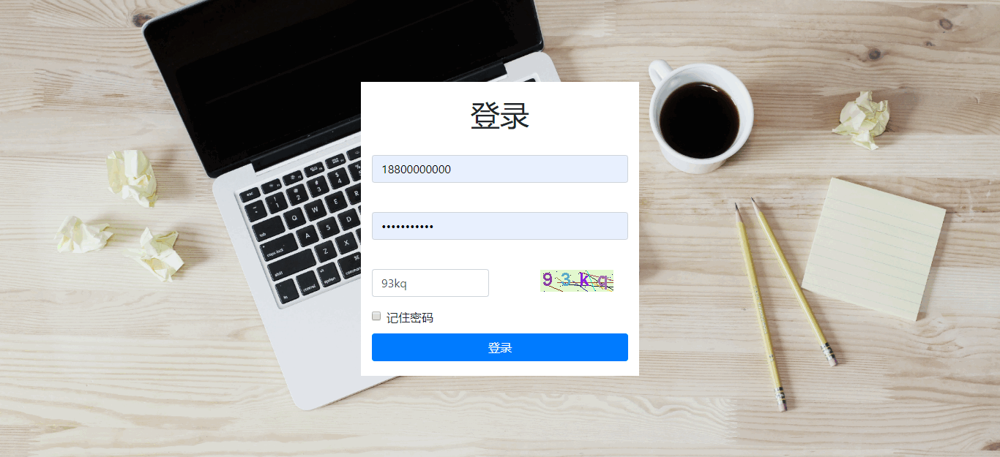
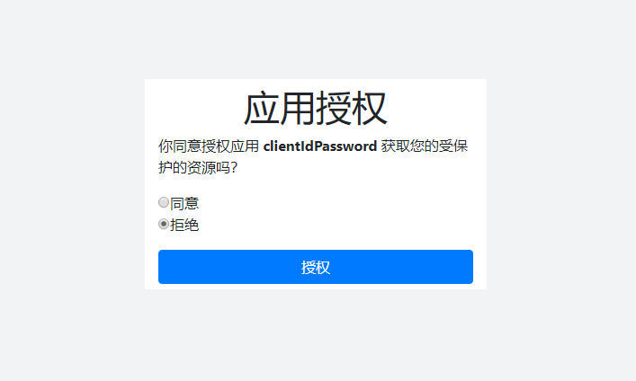

## api模块测试
`com.simon.common.config.OAuthSecurityConfig.java`的`clients`配置如下：
``` java
@Override
public void configure(ClientDetailsServiceConfigurer clients) throws Exception {
    clients.inMemory()
            .withClient("clientIdPassword")
            .redirectUris("http://www.baidu.com")
            .secret("$2a$11$uBcjOC6qWFpxkQJtPyMhPOweH.8gP3Ig1mt27mGDpBncR7gErOuF6") //明文secret
            .scopes("read,write,trust")
            .authorizedGrantTypes("authorization_code", "refresh_token", "password", "client_credentials")
            .authorities("ROLE_ADMIN", "ROLE_USER")
            .accessTokenValiditySeconds(7200)//access_token有效期为2小时
            .refreshTokenValiditySeconds(5184000)//refresh_token有效期为2个月60天
            .autoApprove(false);
    //clients.jdbc(dataSource);
}
```

**token相关的接口，都需要进行Basic Oauth认证。**  
如下图所示：  


> 1、获取access_token
>> 1.1 手机号+密码
>>> POST [http://localhost:8181/oauth/token?grant_type=password&username=18800000000&password=1234567890c](http://localhost:8181/oauth/token?grant_type=password&username=18800000000&password=1234567890c)

>> 1.2 手机号+验证码
>>> POST [http://localhost:8181/oauth/token?grant_type=password&username=18800000000&password=123456&auth_type=sms](http://localhost:8181/oauth/token?grant_type=password&username=18800000000&password=123456&auth_type=sms)  
注：验证码必须先通过[http://localhost:8181/api/veriCodes/sms/18800000000](http://localhost:8181/api/veriCodes/sms/18800000000)获取，测试账号验证码都是123456。

>> 1.3 邮箱+密码
>>> POST [http://localhost:8181/oauth/token?grant_type=password&username=18800000000@163.com&password=1234567890c](http://localhost:8181/oauth/token?grant_type=password&username=18800000000@163.com&password=1234567890c)

**成功示例**  
status=200，返回的json数据：
``` json
{
    "access_token": "ca582cd1-be6c-4a5a-82ec-10af7a8e06eb",
    "token_type": "bearer",
    "refresh_token": "c24a6143-97c8-4642-88b9-d5c5b902b487",
    "expires_in": 3824,
    "scope": "read write trust"
}
```
**失败示例**  
1. 用户名错误  
status=400，返回的json数据：
``` json
{
    "code": 400,
    "message": "用户名不存在",
    "data": null
}
```
2. 密码错误  
status=400，返回的json数据：
``` json
{
    "code": 400,
    "message": "密码错误",
    "data": null
}
```
3. 账号被封enabled=false  
status=400，返回的json数据：
``` json
{
    "code": 400,
    "message": "您已被封号",
    "data": null
}
```

> 2、检查access_token
>> GET [http://localhost:8181/oauth/check_token?token=ca582cd1-be6c-4a5a-82ec-10af7a8e06eb](http://localhost:8181/oauth/check_token?token=ca582cd1-be6c-4a5a-82ec-10af7a8e06eb)

**成功示例**  
即使用户被封enabled=false，access_token未过期仍然可用。  
status=200，返回的json数据：
``` json
{
    "aud": [
        "oauth2-resource"
    ],
    "exp": 1524507296,
    "user_name": "jeesun",
    "authorities": [
        "ROLE_ADMIN",
        "ROLE_USER"
    ],
    "client_id": "clientIdPassword",
    "scope": [
        "read",
        "write",
        "trust"
    ]
}
```
**失败示例**  
access_token已过期  
status=400，返回的json数据：
``` json
{
    "code": 400,
    "message": "Token无法识别",
    "data": null
}
```

> 3、根据refresh_token获取新的access_token
>> POST [http://localhost:8181/oauth/token?grant_type=refresh_token&refresh_token=c24a6143-97c8-4642-88b9-d5c5b902b487](http://localhost:8181/oauth/token?grant_type=refresh_token&refresh_token=c24a6143-97c8-4642-88b9-d5c5b902b487)

**成功示例**  
status=200，返回的json数据：
``` json
{
    "access_token": "690ecd7d-f2b7-4faa-ac45-5b7a319478e8",
    "token_type": "bearer",
    "refresh_token": "c24a6143-97c8-4642-88b9-d5c5b902b487",
    "expires_in": 7199,
    "scope": "read write trust"
}
```

**失败示例**  
用户被封enabled=false  
status=401，返回的json数据：
``` json
{
    "code": 401,
    "message": "用户已失效",
    "data": null
}
```

> 4、根据授权码获取token
>>POST [http://localhost:8181/oauth/authorize?response_type=code&client_id=clientIdPassword&scope=read&redirect_uri=http://www.baidu.com](http://localhost:8181/oauth/authorize?response_type=code&client_id=clientIdPassword&scope=read&redirect_uri=http://www.baidu.com)

  
同意授权，跳转到`https://www.baidu.com/?code=jgA1h3`，`jgA1h3`就是授权码。  
使用授权码获取token:   
>>POST [http://localhost:8181/oauth/token?grant_type=authorization_code&code=jgA1h3&redirect_uri=http://www.baidu.com](http://localhost:8181/oauth/token?grant_type=authorization_code&code=jgA1h3&redirect_uri=http://www.baidu.com)  

**成功示例**  
status=200，返回的json数据：
``` json
{
    "access_token": "ca582cd1-be6c-4a5a-82ec-10af7a8e06eb",
    "token_type": "bearer",
    "refresh_token": "c24a6143-97c8-4642-88b9-d5c5b902b487",
    "expires_in": 3824,
    "scope": "read write trust"
}
```

## app实践指南
app获取到token信息后，需要保存token信息和请求时间。在传access_token之前，需要检查access_token是否过期。为了减少后台压力，检查access_token是否过期应该是在app本地完成。通过token的key`expires_in`（剩余有效期）的值，以及本地记录的请求时间，和当前时间做对比，可以很方便地判断出access_token是否过期。如果过期了，需要通过refresh_token获取新的access_token。因为access_token的有效期只有2个小时，这个验证是必须的。    
refresh_token同理。  
但是，Spring Security Oauth2授权框架没有解决一个账号多端登录的问题。账号和token是一对一的关系，如果系统允许一个账号多端登录，那么必然出现以下这种情况。用户在客户端A和客户端B同时登录，客户端A的access_token过期了，客户端A选择刷新access_token；在客户端A刷新了access_token之后，客户端B发现自己手上的access_token不可用了，也选择刷新access_token，造成客户端A手上的access_token不可用了，循环反复，客户端A和客户端B一直在疯狂刷新access_token。  
如何解决上面的问题呢？此处提供三种解决方案以供参考。  
1. 设置access_token永不失效，不去刷新access_token；
2. 自定义刷新access_token的请求接口，在接口里判断access_token是否过期，过期了就刷新并返回access_token，没过期就直接返回access_token。
3. 记录每次刷新token的设备，如果这一次刷新的设备和上一次一致就返回新token，如果设备不一致就返回上一次的token，如果上一次的token已过期就返回新token，这样让两台设备的token保持一样就不会出现问题。